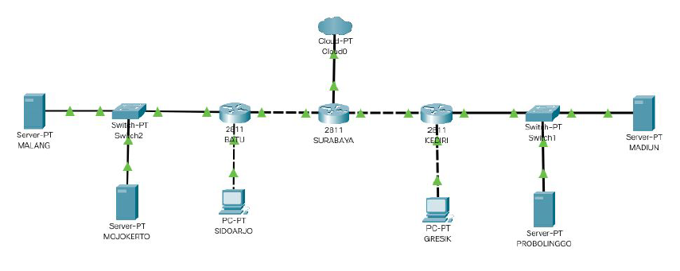
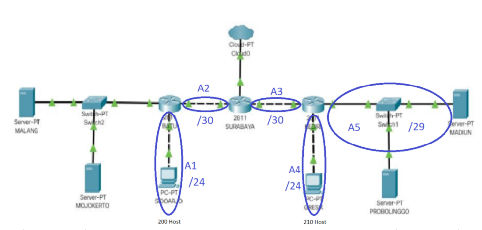
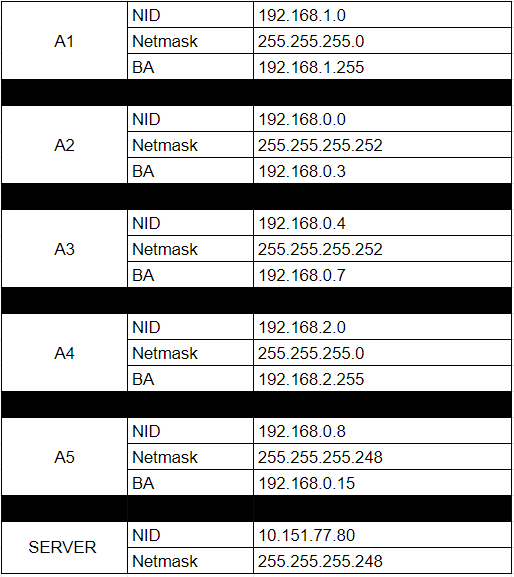
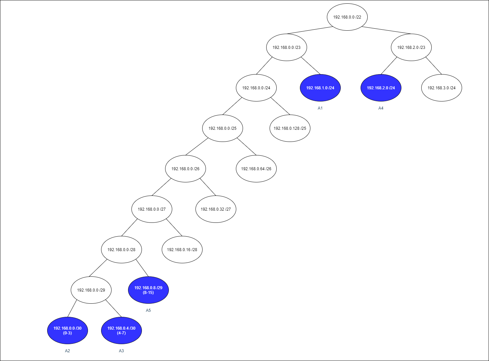
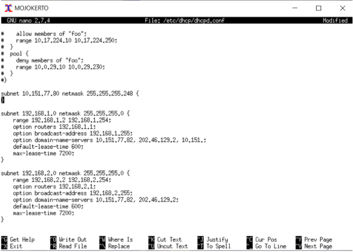
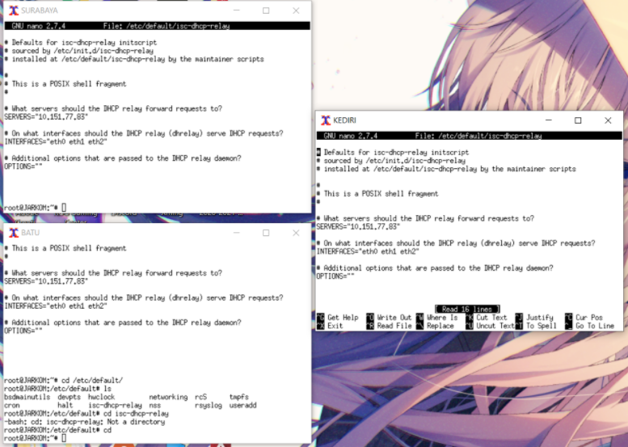
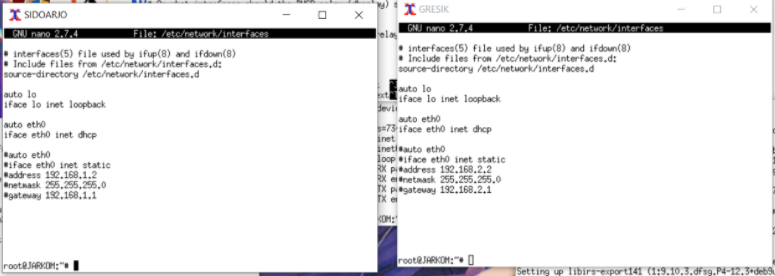

# Modul5_C09
Kelompok C09
- 05111840000028  M. Frediansyah Sinaga
- 05111840000072  Kresna Adhi Pramana

Praktikum Modul 5 berupa *Firewall*.


## Soal
* Tugas pertama kalian yaitu membuat topologi jaringan sesuai dengan rancangan yang diberikan
    Bibah seperti dibawah ini :
      
    Keterangan : 
    * SURABAYA diberikan IP TUNTAP
    * MALANG merupakan DNS Server diberikan IP DMZ
    * MOJOKERTO merupakan DHCP Server diberikan IP DMZ
    * MADIUN dan PROBOLINGGO merupakan WEB Server
    * Setiap Server diberikan memory sebesar 128M
    * Client dan Router diberikan memori sebesar 96M
    * Jumlah host pada subnet SIDOARJO 200 Host
    * Jumlah host pada subnet GRESIK 210 Host
* Karena kalian telah mempelajari Subnetting dan Routing, Bibah meminta kalian untuk membuat
    topologi tersebut menggunakan teknik CIDR atau VLSM . Setelah melakukan subnetting,
* kalian juga diharuskan melakukan routing agar setiap perangkat pada jaringan tersebut dapat terhubung.
* Tugas berikutnya adalah memberikan ip pada subnet SIDOARJO dan GRESIK secara dinamis
    menggunakan bantuan DHCP SERVER (Selain subnet tersebut menggunakan ip static). Kemudian
    kalian mengingat bahwa kalian harus setting DHCP RELAY pada router yang menghubungkannya,
    seperti yang kalian telah pelajari di masa lalu.

___

1. Agar topologi yang kalian buat dapat mengakses keluar, kalian diminta untuk mengkonfigurasi
    SURABAYA menggunakan iptables, namun Bibah tidak ingin kalian menggunakan
    MASQUERADE.
2. Kalian diminta untuk mendrop semua akses SSH dari luar Topologi (UML) Kalian pada server
    yang memiliki ip DMZ (DHCP dan DNS SERVER) pada SURABAYA demi menjaga keamanan.
3. Karena tim kalian maksimal terdiri dari 3 orang, Bibah meminta kalian untuk membatasi DHCP
    dan DNS server hanya boleh menerima maksimal 3 koneksi ICMP secara bersamaan yang berasal dari
    mana saja menggunakan iptables pada masing masing server , selebihnya akan di DROP.
    kemudian kalian diminta untuk membatasi akses ke MALANG yang berasal dari SUBNET
    SIDOARJO dan SUBNET GRESIK dengan peraturan sebagai berikut:
4. Akses dari subnet SIDOARJO hanya diperbolehkan pada pukul 07.00 - 17.00 pada hari Senin
    sampai Jumat.
5. Akses dari subnet GRESIK hanya diperbolehkan pada pukul 17.00 hingga pukul 07.00 setiap
    harinya.
    Selain itu paket akan di REJECT.
    Karena kita memiliki 2 buah WEB Server, 
6. Bibah ingin SURABAYA disetting sehingga setiap
    request dari client yang mengakses DNS Server akan didistribusikan secara bergantian pada
    PROBOLINGGO port 80 dan MADIUN port 80.
7. Bibah ingin agar semua paket didrop oleh firewall (dalam topologi) tercatat dalam log pada setiap
    UML yang memiliki aturan drop.
    Bibah berterima kasih kepada kalian karena telah mau membantunya. Bibah juga mengingatkan agar
    semua aturan iptables harus disimpan pada sistem atau paling tidak kalian menyediakan script sebagai
    backup.
    
    
## Jawaban
### A, B, dan C
VLSM


Jumlah alamat IP yang dibutuhkan oleh tiap subnet dan labelling netmask berdasarkan jumlah IP yang dibutuhkan.
| Subnet  | Jumlah IP | Netmask   |
| ------- | --------- | --------- |
| A1      | 201       | /24       |
| A2      | 2         | /30       |
| A3      | 2         | /30       |
| A4      | 211       | /24       |
| A5      | 3         | /29       |
| Total   | 419       | /23       |

Berdasarkan total IP, netmask yang dibutuhkan, dan netmask /24 ada 2, maka kita dapat menggunakan netmask /22 untuk memberikan pengalamatan IP pada subnet.

Subnetting dengan menggunakan pohon untuk pembagian IP sesuai dengan kebutuhan masing-masing subnet yang ada.  


Dari pohon tersebut akan mendapat pembagian IP sebagai berikut.


Routing
1. SURABAYA  
    A1		192.168.1.0/24 via 192.168.0.2  
    A4		192.168.2.0/24 via 192.168.0.6  
    A5		192.168.0.8/29 via 192.168.0.6  
    SERVER	10.151.77.80/29 via 192.168.0.2	 
2. KEDIRI  
    GENERAL	0.0.0.0/0 via 192.168.0.5	
3. BATU  
    GENERAL	0.0.0.0/0 via 192.168.0.1  
    
### D
1. Buat topologi.sh
2. Edit nano /etc/sysctl.conf pada semua router agar bisa forward ip
3. Masukkan interface masing-masing uml
4. Lakukan service networking restart
5. Masukkan routingan kedalam file route.sh pada masing2 router dan Jalankan dengan source route.sh
6. Lalu ketikkan perintah bash iptables.sh yang berisi iptables –t nat –A POSTROUTING –o eth0 –j MASQUERADE –s 192.168.0.0/16.
7. Export proxy di setiap UML
8. Apt-get update setiap UML
9. Install DHCP Server di Mojokerto dengan perintah apt-get install isc-dhcp-server 
10. Lalu jalankan perintah nano /etc/default/isc-dhcp-server untuk mengisi interface dengan “eth0”
11. Konfigurasi dhcp dengan perintah : nano /etc/dhcp/dhcpd.conf dan edit menjadi:
    
12. Restart dengan perintah service isc-dhcp-server restart. Jika terjadi failed!, maka stop dulu, kemudian start kembali service isc-dhcp-server stop service isc-dhcp-server        start.
13. Install DHCP-relay di BATU, SURABAYA,dan KEDIRI dengan perintah apt-get install isc-dhcp-relay.
14. Isi konfigurasi dhcp relay pada BATU , SURABAYA, KEDIRI
    
15. Ubah interface pada SIDOARJO dan GRESIK menjadi:
     auto eth0
     iface eth0 inet dhcp
     
16. Lalu lakukan perintah service networking restart pada setiap klien

___

### Jawaban Soal

1. Buat file no1.sh di SBY  
    ```
    iptables -t nat -A POSTROUTING -s 192.168.0.0/16 -o eth0 -j SNAT --to-source 10.151.76.42
    ```
2. Buat file no2.sh di SBY  
    ```
    iptables -A FORWARD -p tcp --dport 22 -d 10.151.77.80/29 -i eth0 -j DROP
    ```
3. Buat file no3.sh di MALANG dan MOJOKERTO yang berisi   
    ```
    iptables -A INPUT -p icmp -m connlimit --connlimit-above 3 --connlimit-mask 0 -j DROP
    ```
4. Buat file no4.sh di MALANG  
    ```
    iptables -A INPUT -s 192.168.1.0/24 -m time --timestart 07:00 --timestop 17:00 --weekdays Mon,Tue,Wed,Thu,Fri -j ACCEPT
    iptables -A INPUT -s 192.168.1.0/24 -j REJECT 
    ```
5. Buat file no5.sh di MALANG  
    ```
    iptables -A INPUT -s 192.168.2.0/24 -m time --timestart 07:01 --timestop 16:59 -j REJECT
    ```
6. Buat file no6.sh di SBY  
    ```
    iptables -t nat -A PREROUTING -p tcp -d 10.151.77.82 -m statistic --mode nth --every 2 --packet 0 -j DNAT --to-destination 192.168.0.11:80
    iptables -t nat -A PREROUTING -p tcp -d 10.151.77.82 -j DNAT --to-destination 192.168.0.10:80
    ```

7. Buat file no7.sh di MALANG, MOJOKERTO, SURABAYA  
    ```
    iptables -N LOGGING
    iptables -A LOGGING -j LOG --log-prefix "Dropped Packet : " --log-level 4
    iptables -A LOGGING -j DROP
    ```
    Yang DROP pada iptables nomor 2 dan 3 diganti LOGGING
